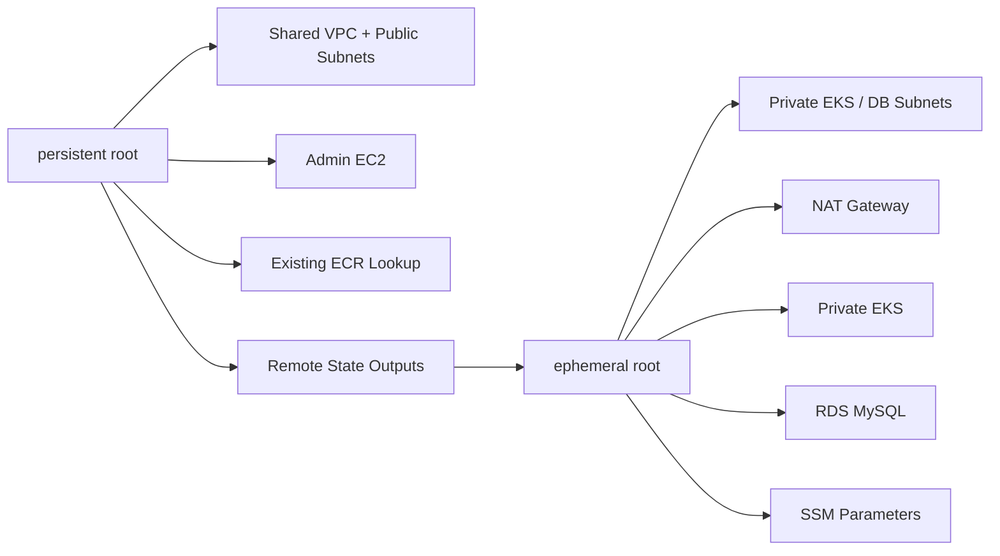

# skyline-infra-terraform

[한국어 README](./README.md)

This repo contains the AWS Terraform and bootstrap layer for the Skyline demo environment.  
The point is not just to stand up EKS and RDS, but to **separate long-lived infrastructure from disposable workload layers and make the private-cluster operating path understandable**.

The operating model is centered on two Terraform roots:

- `roots/persistent`: long-lived access plane
- `roots/ephemeral`: disposable workload plane

> This repo does not claim to be a finished production platform.  
> A more accurate description is a demo Terraform snapshot where the admin EC2 and public network stay stable while EKS, NAT, private subnets, and RDS can be recreated as needed.

## Highlights

- explicit `persistent` / `ephemeral` root separation
- split between public access plane and private workload plane
- remote-state handoff between the two roots
- private EKS, private DB subnets, NAT, and RDS MySQL grouped into the recreatable layer
- bootstrap path for SSM Parameter Store and External Secrets
- migration runbook for moving from the legacy combined root into the split roots

## Architecture



## Summary

| Area | Contents |
|---|---|
| Persistent root | shared VPC, Internet Gateway, public subnet, admin EC2, existing ECR lookup |
| Ephemeral root | private EKS subnet, private DB subnet, NAT, EKS, node group, OIDC, RDS MySQL, SSM parameters |
| Cluster access | admin EC2 IAM role + `aws_eks_access_entry` + security-group rule |
| Secret flow | Terraform-managed Parameter Store values later consumed via External Secrets |
| Migration | runbook for splitting legacy combined-root state into the new roots |

## Repo Structure

```text
roots/
├── persistent/
└── ephemeral/

modules/
├── admin_ec2/
├── eks/
├── network_public/
├── network_private/
├── rds_mysql/
└── vpc/

docs/
└── migration-runbook.md
```

The legacy combined root still exists at the repo root, but normal day-to-day usage should target `roots/persistent` and `roots/ephemeral`.

## Prerequisites

- Terraform `1.14.x`
- AWS credentials able to manage VPC, EC2, EKS, RDS, IAM, and SSM
- an existing EC2 key pair in the target account and region
- AWS CLI for kubeconfig updates and ECR-related checks

## Quick Start

### 1. Prepare tfvars

```bash
cp roots/persistent/terraform.tfvars.example roots/persistent/terraform.tfvars
cp roots/ephemeral/terraform.tfvars.example roots/ephemeral/terraform.tfvars
```

Important `persistent` values:

- `key_pair_name`
- `admin_access_cidr`
- `public_subnet_cidrs`
- `existing_ecr_repository_name`
- `parameter_store_prefix`

Important `ephemeral` values:

- `private_eks_subnet_cidrs`
- `private_db_subnet_cidrs`
- `eks_public_access_cidrs`
- `parameter_store_prefix`
- `db_name`
- `db_username`
- `persistent_state_bucket`
- `persistent_state_key`

### 2. Initialize Roots

```bash
terraform -chdir=roots/persistent init
terraform -chdir=roots/ephemeral init
```

### 3. Apply in Order

Long-lived layer:

```bash
terraform -chdir=roots/persistent plan
terraform -chdir=roots/persistent apply
```

Recreatable layer:

```bash
terraform -chdir=roots/ephemeral plan
terraform -chdir=roots/ephemeral apply
```

Cost cleanup:

```bash
terraform -chdir=roots/ephemeral destroy
```

## Bootstrap From the Admin EC2

The admin EC2 writes a helper script for post-EKS setup:

- `/usr/local/bin/skyline-setup-eks.sh`

Run it after the ephemeral root has been applied:

```bash
sudo /usr/local/bin/skyline-setup-eks.sh
```

That script:

- updates kubeconfig for `root` and `ec2-user`
- installs or upgrades the AWS Load Balancer Controller
- installs or upgrades External Secrets and its CRDs
- creates the `skyline` namespace
- creates the `SecretStore` and `ExternalSecret`
- syncs the existing SSM database parameters into the Kubernetes `skyline-db-secret`

In other words, Terraform remains the source of truth for Parameter Store values, and the bootstrap script connects Kubernetes to those existing parameters.

## Validation

After apply, the basic checks from the admin EC2 are:

```bash
sudo /usr/local/bin/skyline-setup-eks.sh
kubectl get nodes
kubectl get crd externalsecrets.external-secrets.io secretstores.external-secrets.io
kubectl get deployment -n kube-system aws-load-balancer-controller
kubectl get deployment -n external-secrets external-secrets
kubectl get secret -n skyline skyline-db-secret
```

## Apply Impact and Operational Notes

- if the admin EC2 `user_data` changes in the `persistent` root, `user_data_replace_on_change = true` means Terraform will replace that instance
- such a change should typically be limited to the admin EC2 and related security-group adjustments, not a full VPC / EKS / RDS rebuild
- because the DB password is stored as `SecureString`, the External Secrets IAM role also needs `kms:Decrypt`
- always inspect `terraform plan` before apply

## Migration

To move safely from the legacy combined root into the split roots, use [`docs/migration-runbook.md`](./docs/migration-runbook.md).

The goal is to split the state into `persistent` and `ephemeral` without recreating the existing infrastructure.

## Scope and Trade-Offs

What this repo proves:

- a Terraform layout that separates long-lived and disposable layers
- an admin-EC2-based operating path for a private EKS cluster
- a realistic demo secret flow using Parameter Store and External Secrets

What this repo does not prove:

- fully hardened production IAM with strict least privilege
- production-grade durability such as HA NAT, Multi-AZ DB hardening, and deletion protection
- full GitHub-Actions-based IaC automation
- complete declarative management of every bootstrap layer

Known trade-offs:

- the admin EC2 exists to make cluster operations practical quickly; it is not presented as the desired bastionless end state
- the `ephemeral` root favors reproducibility and cost control over always-on high availability
- the legacy root remains for compatibility and migration, while the split roots are the recommended operating model
