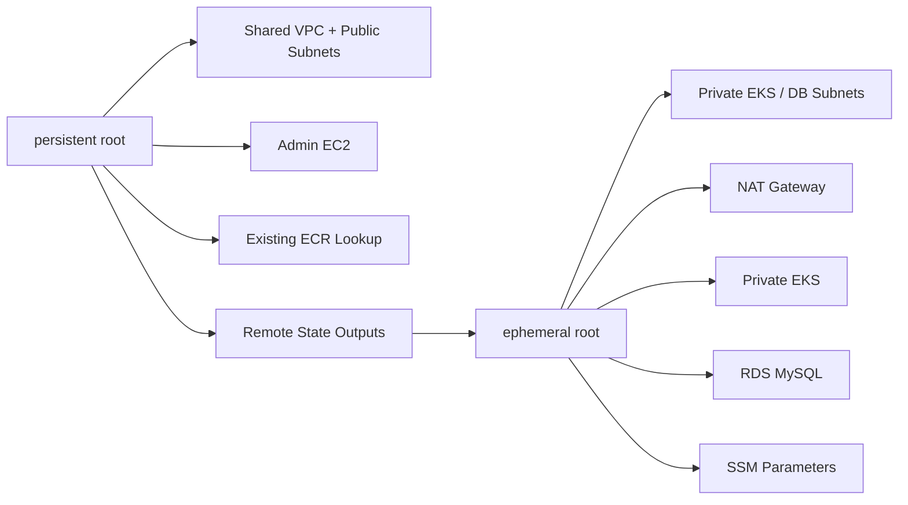

# skyline-infra-terraform

[English README](./README.en.md)

이 repo는 Skyline demo 환경을 위한 AWS Terraform 및 bootstrap repo입니다.  
핵심은 단순히 EKS와 RDS를 띄우는 것이 아니라, **장기 유지 계층과 재생성 가능한 계층을 분리하고 private cluster 운영 경로를 설명 가능한 형태로 정리한 것**에 있습니다.

이 repo의 운영 모델은 두 개의 Terraform root를 중심으로 합니다.

- `roots/persistent`: 장기 유지 access plane
- `roots/ephemeral`: 필요 시 재생성 가능한 workload plane

> 이 repo는 완성된 production platform을 주장하지 않습니다.  
> 보다 정확히는, admin EC2와 public network는 안정적으로 유지하고, EKS / NAT / private subnet / RDS는 반복 생성과 정리에 맞게 분리한 demo Terraform snapshot입니다.

## Highlights

- `persistent` / `ephemeral` root 분리
- public access plane과 private workload plane 분리
- remote state를 통해 두 root를 연결
- private EKS, private DB subnet, NAT, RDS MySQL을 재생성 가능한 계층으로 구성
- SSM Parameter Store와 External Secrets를 연결하는 bootstrap 경로 포함
- legacy 단일 root에서 split root로 이전하기 위한 migration runbook 포함

## Architecture



## 구성 요약

| 영역 | 내용 |
|---|---|
| Persistent root | shared VPC, Internet Gateway, public subnet, admin EC2, existing ECR lookup |
| Ephemeral root | private EKS subnet, private DB subnet, NAT, EKS, node group, OIDC, RDS MySQL, SSM parameters |
| Cluster access | admin EC2 IAM role + `aws_eks_access_entry` + security group rule |
| Secret flow | Terraform-managed Parameter Store values consumed later via External Secrets |
| Migration | legacy combined root state를 split roots로 옮기는 runbook 제공 |

## Repo Structure

```text
roots/
├── persistent/
└── ephemeral/

modules/
├── admin_ec2/
├── eks/
├── network_public/
├── network_private/
├── rds_mysql/
└── vpc/

docs/
└── migration-runbook.md
```

repo 루트에는 legacy combined root도 남아 있지만, 일상적인 작업 기준은 `roots/persistent`와 `roots/ephemeral`입니다.

## Prerequisites

- Terraform `1.14.x`
- VPC, EC2, EKS, RDS, IAM, SSM을 다룰 수 있는 AWS 자격 증명
- 대상 계정/리전에 이미 존재하는 EC2 key pair
- `kubeconfig` 업데이트와 ECR 확인에 사용할 AWS CLI

## Quick Start

### 1. Prepare tfvars

```bash
cp roots/persistent/terraform.tfvars.example roots/persistent/terraform.tfvars
cp roots/ephemeral/terraform.tfvars.example roots/ephemeral/terraform.tfvars
```

주요 `persistent` 값:

- `key_pair_name`
- `admin_access_cidr`
- `public_subnet_cidrs`
- `existing_ecr_repository_name`
- `parameter_store_prefix`

주요 `ephemeral` 값:

- `private_eks_subnet_cidrs`
- `private_db_subnet_cidrs`
- `eks_public_access_cidrs`
- `parameter_store_prefix`
- `db_name`
- `db_username`
- `persistent_state_bucket`
- `persistent_state_key`

### 2. Initialize Roots

```bash
terraform -chdir=roots/persistent init
terraform -chdir=roots/ephemeral init
```

### 3. Apply in Order

장기 유지 계층:

```bash
terraform -chdir=roots/persistent plan
terraform -chdir=roots/persistent apply
```

재생성 가능한 계층:

```bash
terraform -chdir=roots/ephemeral plan
terraform -chdir=roots/ephemeral apply
```

비용 정리를 위한 cleanup:

```bash
terraform -chdir=roots/ephemeral destroy
```

## Bootstrap From the Admin EC2

admin EC2에는 EKS 후속 설정을 위한 helper script가 포함됩니다.

- `/usr/local/bin/skyline-setup-eks.sh`

ephemeral root 적용 후 실행:

```bash
sudo /usr/local/bin/skyline-setup-eks.sh
```

이 스크립트는 다음 작업을 수행합니다.

- `root`, `ec2-user` 기준 kubeconfig 갱신
- AWS Load Balancer Controller 설치 또는 업그레이드
- External Secrets CRD 및 controller 설치 또는 업그레이드
- `skyline` namespace 생성
- `SecretStore`, `ExternalSecret` 생성
- 기존 SSM database parameter를 Kubernetes `skyline-db-secret`으로 동기화

즉, Parameter Store의 값 자체는 Terraform이 관리하고, bootstrap script는 Kubernetes가 그 값을 소비할 수 있도록 연결하는 역할에 집중합니다.

## Validation

적용 후 admin EC2에서 확인할 수 있는 기본 항목:

```bash
sudo /usr/local/bin/skyline-setup-eks.sh
kubectl get nodes
kubectl get crd externalsecrets.external-secrets.io secretstores.external-secrets.io
kubectl get deployment -n kube-system aws-load-balancer-controller
kubectl get deployment -n external-secrets external-secrets
kubectl get secret -n skyline skyline-db-secret
```

## Apply Impact and Operational Notes

- `persistent` root에서 admin EC2 `user_data`가 바뀌면 `user_data_replace_on_change = true` 때문에 해당 인스턴스는 교체됩니다.
- 이 변경은 일반적으로 admin EC2와 관련 security group 조정 정도에 집중되며, VPC / EKS / RDS 전체 재생성을 의도하지 않습니다.
- DB password는 `SecureString`으로 저장되므로 External Secrets IAM role에는 `kms:Decrypt` 권한이 필요합니다.
- 실제 적용 전에는 항상 `terraform plan`으로 영향 범위를 확인하는 편이 안전합니다.

## Migration

legacy combined root에서 split roots로 안전하게 state를 이전하려면 [`docs/migration-runbook.md`](./docs/migration-runbook.md)를 사용하면 됩니다.

핵심 목적은 기존 인프라를 재생성하지 않고 state만 `persistent` / `ephemeral`로 분리하는 것입니다.

## Scope and Trade-Offs

이 repo가 증명하는 것:

- 장기 유지 계층과 재생성 가능한 계층을 분리한 Terraform 구조
- private EKS 운영을 위한 admin EC2 기반 접근 경로
- Parameter Store와 External Secrets를 연결하는 현실적인 demo secret flow

이 repo가 증명하지 않는 것:

- strict least privilege가 완전히 적용된 production IAM
- HA NAT, Multi-AZ DB hardening, deletion protection 등 production-grade durability
- 완전한 GitHub Actions 기반 IaC automation
- 모든 bootstrap 레이어의 선언형 관리

알려진 trade-off:

- admin EC2는 빠른 운영 경로 확보를 위한 선택이며, bastionless access의 최종 형태는 아닙니다.
- `ephemeral` root는 재현성과 비용 제어를 우선한 구조이며, 항상 켜져 있는 고가용성 플랫폼을 목표로 한 구성이 아닙니다.
- repo 루트의 legacy root는 이전 호환성과 migration 목적상 남아 있으며, 권장 운영 기준은 split roots입니다.
